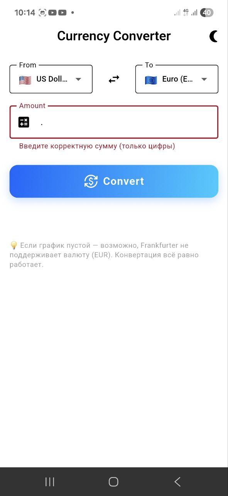
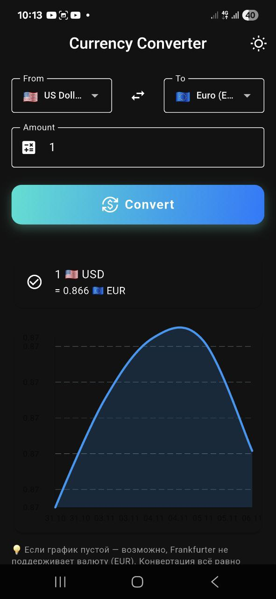
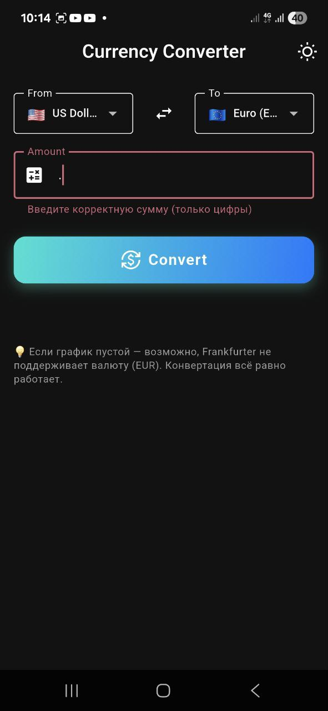

💱 Currency Converter 
A simple and elegant Flutter app for currency conversion with a historical exchange rate chart.

✨ Features
Convert between different currencies
View historical exchange rate data in a beautiful chart
Support for major world currencies 🌎
Display flags for each currency
🛠 Technologies
Flutter – Cross-platform framework
BLoC – State management
Equatable – Simplifies object comparison
GetIt – Dependency injection
Dio – HTTP client for API requests
FlChart – Chart rendering
Sqflite – Local data storage
Intl – Internationalization & formatting

⚡ Installation
Make sure Flutter SDK is installed
Clone the repository:
git clone <your-repo-url>
Navigate to the project directory:
cd currency_converter_app
Install dependencies:
flutter pub get
▶ Running the App
Run the application on a connected device or emulator:
flutter run

Nazira Altybaeva — Flutter developer
🌐 APIs
The app uses the following APIs:
FreeCurrencyAPI – For current exchange rates
Frankfurter API – For historical exchange rate data
🖼 ## 📸 Screenshots

### 💡 Light Mode

### 🌙 Dark Mode

### ⚙️ Converter (Dark)

### 🚫 Error Example

## 🎥 Demo Video

[▶️ Watch Demo](assets/demo/currency.demo.mp4)

📌 Authorer Developer
Portfolio: GitHub | LinkedIn: LinkedIn
